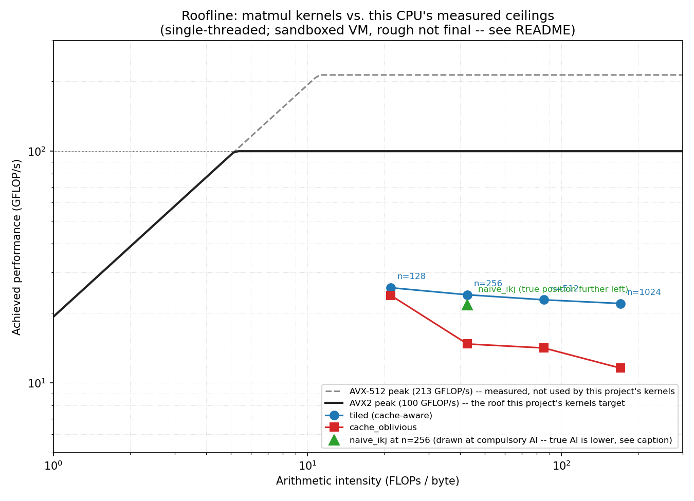

# Zero-Allocation SIMD Micro-Inference Engine

A bare-metal C++ hot path for a market-making/prediction system: feed → order
book → features → inference → decision, built for nanosecond-scale latency
rather than throughput. Portfolio project aimed at AI hardware and HFT/quant
systems roles — the "why" for each design choice below is written for that
audience, not just for correctness.

## Status

**Components 1–5/6 done, plus the end-to-end integration** (feed → ring
buffer → order book → features → QuickScorer, running as one real
two-thread pipeline). Component 6 (autotuning) was considered and
deliberately skipped — see "Roadmap" for why.

## Design: the order book

Real order books are usually built on a sorted structure keyed by price (a
red-black tree, `std::map`, a skip list). This one deliberately isn't:
tree rebalancing and pointer chasing are exactly the kind of
unpredictable-latency operations a hot path exists to eliminate. Instead:

- **Price levels are a flat array**, indexed by `price - base_price`. Adding,
  cancelling, or modifying an order's quantity is O(1): direct index, no
  search.
- **Best bid / best ask is a hardware bit-scan**, not a tree walk. Each side
  keeps a bitset (one bit per price level, occupied or not); the best price
  is the highest (bids) or lowest (asks) set bit, found via
  `std::countl_zero` / `std::countr_zero` — one or two instructions once the
  right 64-bit word is loaded.
- **Orders live in a pre-sized arena** (`std::array<Order, MAX_ORDERS>`), not
  behind `new`. A free-list (a stack of unused slot indices) hands out and
  reclaims slots in O(1) with zero heap traffic after startup. Orders within
  a price level form an intrusive doubly-linked FIFO queue using indices
  into the same arena instead of pointers, so price-time priority is
  maintained without any allocation.
- **`Order` is padded to exactly 64 bytes** (`alignas(64)`, verified with
  `static_assert(sizeof(Order) == 64)`) — one cache line per order, so
  walking a price level's FIFO never pulls in part of a neighboring order
  for free, and never straddles two lines for one order.
- **id → arena-slot lookup is a fixed-capacity open-addressing hash table**
  with backward-shift deletion (`include/orderbook/id_index.hpp`) instead of
  tombstones. Tombstoned deletes make every future lookup slower until you
  rehash; backward-shift closes the gap immediately, so `find` never
  degrades and the table never needs a rehash pass.

**Known limitation:** the book covers a fixed price window
(`[base_price, base_price + NUM_LEVELS)`) and does not auto-rebase if the
market walks out of range. A real system would need a rebasing strategy
(or a wide enough window that it's a non-issue in practice); left as a
known gap rather than silently handled.

## Design: QuickScorer

Naive GBDT inference walks each tree node by node — a data-dependent branch
per node, which the branch predictor handles poorly when the input isn't
following a learnable pattern (exactly the case for live features, as
opposed to a benchmark that keeps reusing the same input). QuickScorer
(Lucchese et al., SIGIR 2015) replaces the walk with a bitmask AND-reduction
that touches every node but never branches on the input:

- Leaves are numbered left to right and given a bit position (0 to 63 — this
  implementation caps trees at 64 leaves, rejected with an exception at
  build time otherwise, since the mask is a single `uint64_t`).
- Every internal node gets a precomputed `false_mask`: 0 bits at the leaf
  positions in that node's *left* subtree, 1s elsewhere.
- To evaluate: start with a mask of all 1s. For every node, if the test is
  false (`x[feature] >= threshold`, i.e. the real walk would go right), AND
  the node's `false_mask` into the running mask. The correct leaf's bit is
  provably never cleared by this process (a node on the true path only
  clears bits when the true path itself goes right, and it only clears the
  *other* branch's bits) and every leaf to its left provably always is,
  since a leaf to the left of the true target diverges from it at some
  ancestor where the true path goes right — so the leftmost surviving bit
  after processing every node, found with `std::countr_zero`, is always the
  right answer, regardless of what's still set to its right. That "leftmost
  surviving bit is always correct, other surviving bits don't matter" claim
  is exactly what `test_random_differential` checks 90,000 times over (not
  just the final value — the leaf *index* itself, cross-checked against the
  naive walker's own numbering).
- The `if test-is-false` is itself removed via a select-without-branching
  trick: `mask &= (false_mask | (-(uint64_t)go_left))` — `go_left` as a
  0/1 integer negated is all-0s or all-1s, so the OR either passes
  `false_mask` through unchanged or turns it into a no-op, with no branch
  on the input anywhere in the loop. `eval_branchy` is the same algorithm
  with a real `if`, kept specifically to benchmark against.
- `QSNode` is 16 bytes and deliberately *not* padded to a cache line, unlike
  `Order` in the order book. `Order` is reached through arena indices in a
  pattern that's closer to pointer-chasing, where padding avoids pulling in
  an unrelated neighbor; every node in a tree is read sequentially in a
  tight loop here, so dense packing is what helps — 4 `QSNode`s share one
  cache line, so a small tree's whole node list often costs one or two line
  fetches, not one per node. Same underlying idea (cache-line accounting),
  opposite conclusion, because the access pattern differs.

Rough numbers on this sandbox for a representative tree (17 nodes, 18
leaves), same environment caveats as the order book's — but the inputs here
are freshly randomized *per call* specifically so the branch predictor
can't learn a fixed pattern and hide the effect being measured: branchless
came in at roughly 14–16 ns/eval, branchy at roughly 15–17 ns/eval, a real
but modest gap on a fairly shallow tree in a noisy shared-core sandbox —
worth treating as a directional result to revisit once the rigorous
benchmark harness exists, not a final number.

**A real bug UBSan caught here worth keeping on record:** the mask-building
code guarded against shifting a `uint64_t` by its own width (64) when a
*subtree's leaf count* hit 64, but missed that the *starting bit position*
of a later subtree can independently reach 64 in an oversized (>64-leaf)
tree — which is exactly the case the `>64 leaves` rejection test
deliberately constructs. The fix moved the size check to a cheap leaf-count
pass *before* any mask math runs, rather than checking after the fact once
some of that math had already executed with an out-of-range shift amount.
Caught by the same "always run the sanitizer build, not just the fast one"
policy this project keeps repeating for a reason.

## Design: AVX2 batch evaluation

QuickScorer's scalar path already removes the input-dependent branch; this
vectorizes it across *instances* rather than trees — one tree, 8 input rows
at once, one SIMD lane per row (`include/qscorer/quickscorer_avx2.hpp`).
The fit is closer than it might sound: a SIMD compare (`_mm256_cmp_ps`)
already returns an all-1s/all-0s result per lane directly, which is exactly
the value the scalar path's select-without-branching trick has to construct
by hand (`-(uint64_t)go_left`). There's no extra "convert a boolean to a
mask" step to write — the compare instruction *is* that step.

Two deliberate constraints, both explained in the header rather than left
implicit:

- **Capped at 32 leaves, not QSTree's usual 64.** 8 lanes of 64-bit masks
  don't fit in one 256-bit register; splitting one logical mask across two
  `__m256i`s is real complexity this project doesn't need yet for what's
  meant to be a small-tree model. `QSTreeAVX2::build` throws on anything
  over 32 leaves rather than silently truncating.
- **Input is feature-major (`xs[feature*8 + instance]`), not row-major.**
  A contiguous load then gets you all 8 instances' value for one feature
  directly. Row-major would need a strided gather per feature instead —
  more instructions, and historically slower than a plain load on a lot of
  hardware. This is standard SoA-for-SIMD practice, not specific to this
  project, but it's exactly the kind of layout decision that's easy to get
  backwards if you don't think about it up front.

This CPU (checked via `/proc/cpuinfo` before writing any intrinsics)
actually has full modern AVX-512 — not just `avx512f` but `bf16`/`vnni`/
`fp16` variants, so a recent server part, not an old Skylake-X with the
downclocking problems flagged earlier in this README. AVX-512 (native
8x64-bit lanes, no splitting needed for a 64-leaf tree) would remove the
32-leaf constraint above entirely on hardware like this. Not reached for
here anyway: "this specific machine happens to support it" isn't the same
justification as "the target fleet reliably supports it," and defaulting
to the widest register available on whatever's running the code, rather
than what's actually guaranteed at deploy time, is the exact reflex this
project has been arguing against since the first README section.

Verified the same way as everything else: 60,000 random (tree, batch)
checks, each of the 8 lanes compared individually against the
already-differentially-tested scalar path, plus explicit boundary tests at
exactly 32 leaves (must build) and 64 leaves (must throw). No new bugs
this time — the leaf-position reasoning from QuickScorer's own design
carried over directly, and the two earlier bugs (dead-code elimination,
the shift-by-64 in the leaf-count check) had already forced a level of
care about exactly these kinds of edge cases before this file was
written, not after.

Rough numbers on this sandbox (same caveats: shared single core, no
pinning) for a representative depth-5 tree: AVX2 batch-of-8 came in around
6.2–6.3 ns/instance against roughly 14.6–15.2 ns/instance for the same
tree evaluated 8 times over via the scalar loop — a real, consistent
~2.4x, well short of the naive "8 lanes = 8x" expectation because the
final per-lane leaf lookup (`countr_zero` + array index) is still scalar,
done once per lane after the vectorized part finishes.

## Design: cache-aware vs. cache-oblivious matmul

Four square-matrix implementations, meant to be compared rather than used
standalone (`include/matmul/matmul.hpp`):

- **`naive_ijk`** — textbook `i,j,k` loop order. `B[k][j]` is read with
  stride `n` as `k` varies: a column walk on a row-major matrix.
- **`naive_ikj`** — same computation, `i,k,j` order. `A[i][k]` becomes a
  single scalar hoisted out of the inner loop, and the inner loop walks
  both `B[k][*]` and `C[i][*]` contiguously. Zero blocking, same as
  `ijk` — this isolates how much loop order alone buys, before blocking
  enters at all.
- **`tiled`** — `ikj` order, blocked in all three dimensions, `block_size`
  a runtime parameter specifically so it can be swept rather than baked in.
- **`cache_oblivious`** — recursive divide-and-conquer (Frigo, Leiserson,
  Prokop, Ramachandran): split whichever dimension is currently largest,
  recurse, down to a small fixed base case. No dimension is ever measured
  against a cache size, only against the other two — that alone is what
  makes the recursion pass through a cache-fitting working set at every
  level of a multi-level hierarchy, without the algorithm ever being told
  what those cache sizes are.

**A correctness result worth walking through, because it looked wrong at
first.** `naive_ikj`, `tiled`, and `cache_oblivious` are checked for exact,
bit-identical equality in the tests — not a tolerance comparison. A
recursive K-split *looks* like it should reassociate the sum (two halves
combined), and float addition genuinely isn't associative — an isolated
test confirms that: independently computing two halves and adding them
disagrees with continuous accumulation on ~89% of random trials. But that's
not what this implementation does. The second half of a K-split
accumulates directly into the *same* running `C[i][j]` (`add_to_c=true`)
rather than being computed independently and added as a final step, and a
split always processes the lower sub-range before the higher one. Follow
that through by induction and the whole recursion reduces, for any fixed
`(i,j)`, to a single accumulator touched by additions in strictly
increasing `k` order — identical to `naive_ikj`'s. Checked directly against
an isolated version that *does* materialize both halves before adding (0
mismatches vs. ~89%), not just argued from the code.

`naive_ijk` doesn't get this exactness, for the opposite reason: at `-O3`
its scalar reduction loop (many `k` terms into one `C[i][j]`) gets unrolled
across multiple independent accumulator registers to hide FMA latency, then
combined at the end — reassociating that specific sum. Confirmed in the
generated assembly (`naive_ijk`: repeated `vaddss` into different
registers; `naive_ikj`/`tiled`: 256-bit `vfmadd*ps` vectorizing across
independent `j` locations, no reduction to reassociate), not inferred from
the mismatch alone. It's compared with a float tolerance instead.

**The block-size sweep didn't match the theory, and the theory lost.** The
naive L1-fit calculation (three `block_size`² tiles of A/B/C resident at
once, this box's 48KiB L1d) suggests `block_size <= 64`. Measured
performance at n=512 climbs well past that and plateaus around 128–256,
not before. Likely reasons: the simple "three tiles must fit in L1
simultaneously" model ignores what the compiler's own register-level
blocking already does inside a tile, cache associativity, and hardware
prefetching, all of which change the real optimum from the naive
back-of-envelope number. 128 is what's used below — an empirical choice,
not the theoretical one.

**Honest performance result: cache-oblivious loses here, at every size
tested**, to both `tiled` and even plain `naive_ikj` with zero blocking:

| n    | naive_ikj    | tiled (block=128) | cache_oblivious |
|------|--------------|--------------------|-----------------|
| 128  | 23.7 GFLOP/s | 22.0 GFLOP/s       | 17.5 GFLOP/s    |
| 256  | 23.7 GFLOP/s | 21.0 GFLOP/s       | 17.8 GFLOP/s    |
| 512  | 19.9 GFLOP/s | 21.7 GFLOP/s       | 13.8 GFLOP/s    |
| 1024 | 13.9 GFLOP/s | 19.5 GFLOP/s       | 10.8 GFLOP/s    |

(sandboxed/VM environment, single shared core, no pinning — rough, not
final; but the *relative* ordering here is consistent and repeatable, not
noise). At small sizes, blocking doesn't help yet and even the plain
reordered loop wins; by n=1024, blocking's advantage over no-blocking is
clear (19.5 vs. 13.9), which is the result the whole "cache-aware"
argument predicts. `cache_oblivious` is the one that's supposed to get
this for free at every scale simultaneously, and it's behind at all four.
Most likely mechanical reasons, not yet fixed here: it's built from real
recursive function calls (stack frame and parameter overhead at every
subdivision that a flat loop nest doesn't pay), and its base case is
invoked with non-uniform, runtime-only `(m,k,n)` triples that differ
almost every call (thanks to floor/ceil splitting handling arbitrary
sizes correctly) — a much harder target for the compiler to vectorize
predictably than `tiled`'s fixed-shape inner loop. Reporting this as-is
rather than picking benchmark conditions that would have flattered the
theoretically-nicer algorithm.

## Design: lock-free SPSC ring buffer

The connective tissue the "system, not a kernel benchmark" framing from
the top of this README needed: a feed thread pushes `OrderEvent`s, an
inference thread pops and applies them to a real order book, with no
locks anywhere (`include/pipeline/spsc_ring_buffer.hpp`,
`include/pipeline/order_event.hpp`).

- **Only `head_`/`tail_` are atomic; `buffer_` itself is plain data.** The
  producer release-stores `head_` after writing `buffer_[head]`; the
  consumer acquire-loads `head_` before reading that slot. Acquire-release
  synchronization on one atomic makes everything sequenced-before it (on
  any memory location, not just that atomic) visible to whatever
  sequenced-after the matching acquire — so the plain, non-atomic write to
  `buffer_` is still safely published, without needing `buffer_` to be
  atomic itself. Same reasoning, mirrored, for `tail_`: the consumer
  release-stores it only after finishing its read, so a producer that
  acquire-loads an updated `tail_` knows that slot is now safe to
  overwrite.
- **`head_` and `tail_` are on separate cache lines (`alignas(64)` each),
  deliberately.** The producer only ever writes `head_`; the consumer only
  ever writes `tail_`. Sharing a line would bounce it between the two
  cores' caches on every single push and pop — classic false sharing —
  even though the two threads never touch each other's actual data.
- **The full/empty ambiguity is resolved by reserving one slot.**
  `head_ == tail_` unambiguously means empty; `capacity()` reports
  `Capacity - 1`, not `Capacity`, and says so rather than leaving it a
  silent surprise.

**Verified with a different tool than everything so far, because this is a
different class of bug.** ASan/UBSan catch memory errors and undefined
behavior; neither one looks for a data race, which is the actual
correctness question a lock-free structure raises. Three real tests run
under both a normal optimized build and `-fsanitize=thread`: a
single-threaded fill/drain/wraparound check, a two-real-thread stress test
(500,000 items, producer and consumer genuinely running as separate
`std::thread`s, checked for exact order with zero loss or duplication —
not just "probably fine," actually diffed item by item), and an
end-to-end version wired to a real `OrderBook`: a realistic event sequence
is generated once, deterministically, then replayed two ways — direct and
single-threaded (the reference) vs. through the real two-thread ring
buffer — and both the *transported sequence* and the *resulting order
book state* are checked to match exactly. TSan reports zero races across
all of it. Worth being precise about what that does and doesn't prove:
TSan's happens-before analysis doesn't depend on an actual bad interleaving
occurring during the run the way a plain stress test does, so a clean TSan
result is meaningfully stronger evidence than "the stress test didn't
crash" — but it's still evidence from the interleavings that were
actually exercised, not a proof that no interleaving anywhere could race.

**Honest about what this sandbox can't show:** it has one logical core.
The two threads are genuinely separate `std::thread`s with genuinely
independent stacks, but the OS is time-slicing them on one core, not
running them in parallel — so neither the throughput number nor the
padded-vs-unpadded comparison below means what it would on real
multi-core hardware. Reported anyway, with that caveat attached rather
than omitted: unpadded ran a couple percent faster than padded on this
box, which is consistent with (not contrary to) the padding argument --
false sharing is specifically a cross-core cache-coherency cost, so with
only one core actually running instructions, padding here is pure
overhead (larger footprint, no benefit) with no compensating win to
offset it. The layout is still correct for the hardware it's meant for;
this sandbox just can't demonstrate why.

## Design: roofline analysis

Ceilings this project has been citing informally since the start
("nanoseconds for a tiny model, microseconds for real matrix sizes")
finally measured properly (`tools/roofline_bench.cpp`,
`tools/roofline_plot.py`, chart at `docs/roofline.png`) — neither ceiling
taken from a spec sheet:

**Peak compute: register-resident FMA, no memory traffic at all**, so the
only thing being measured is how fast this core can multiply-add. First
attempt used 16 independent `__m256` accumulator chains (enough to hide
FMA latency) without checking whether more would help — checked anyway,
and it's not a small effect: 16 accumulators sustain ~100.0 GFLOP/s; 17
collapses to ~13 GFLOP/s, an 8x cliff from adding *one* more chain. x86-64
has exactly 16 architectural YMM registers; 16 independent accumulators
fit entirely in registers, and the 17th forces a spill to the stack,
turning a pure-register loop into one with a memory round trip on every
iteration. The cliff sitting precisely between 16 and 17 — not a gradual
slope, not a rough area — is about as clean a confirmation of "this is a
register-allocation limit" as an experiment gets. AVX-512 (32 architectural
ZMM registers, more headroom) measured at ~213.3 GFLOP/s — almost exactly
2x the AVX2 number, which is what doubling the vector width should give if
throughput-per-cycle is otherwise unchanged. That ~2.13x ratio is itself a
finding worth having: it confirms *this specific chip* doesn't hit the
AVX-512 downclocking problem flagged back in the QuickScorer section —
consistent with it being a genuinely modern part (the same one whose full
`avx512_bf16`/`vnni`/`fp16` support got noticed early on), not evidence
about AVX-512 generally.

**Peak memory bandwidth: a STREAM-triad-like pass over a 1.8GB working
set**, comfortably past this box's 260MiB L3 so it's actually hitting
DRAM. Measured ~19.3 GB/s. Reported as the relevant roof for this project
specifically because it's single-threaded, matching every kernel built so
far — not this machine's aggregate multi-channel bandwidth, which a
multi-threaded program could approach far more of.

**Where arithmetic intensity gets genuinely awkward, and why matmul is the
only kernel that gets the full treatment here:** AI is FLOPs per byte
moved, and the roofline model was built for FLOP-dominated kernels.
Matmul fits cleanly — `2n³` FLOPs against a `3n²`-float compulsory memory
floor (read A, read B, write C, each once) gives an AI that grows with
`n`, exactly the lever cache blocking exists to pull. QuickScorer and the
order book don't fit the same way: their cost is dominated by branches,
pointer-chasing-adjacent memory access, and comparisons, not
floating-point throughput. Forcing a FLOPs/byte number onto them wouldn't
describe their actual bottleneck — they're latency-and-branch-bound
problems, not throughput-bound ones, and the honest move is saying so
rather than computing a number that doesn't mean what a roofline number is
supposed to mean.

**The chart's real finding isn't the ranking (already known from component
3) — it's the size of the gap.** All four `(n, AI)` points for `tiled`/
`cache_oblivious` sit well past the roofline's knee (~AI 9), meaning this
problem is compute-bound territory at every size tested, not memory-bound.
And every single point sits far under even the AVX2 roof (100.0 GFLOP/s) —
`tiled`'s best measured result here (~26 GFLOP/s) is barely a quarter of
it, `cache_oblivious` less than a tenth. Compute-bound-in-principle and
anywhere-near-the-compute-roof-in-practice are very different claims, and
the peak-compute benchmark's own technique is the reason for the gap:
neither matmul implementation manually manages a bank of independent FMA
accumulator chains the way `roofline_bench.cpp` does — they rely on
whatever the compiler's auto-vectorizer produces, which is real
vectorization (confirmed back in component 3's assembly inspection) but
evidently nothing close to saturating the FMA ports the way a
hand-scheduled kernel does. That's genuine remaining headroom, left alone
here since closing it is its own project, not a roofline-analysis task.
`naive_ikj` is plotted at the same compulsory-AI x-position as
`cache_oblivious` at n=256 for visual reference, annotated as an
upper-bound placeholder — its actual AI is lower (it re-fetches data the
compulsory bound assumes gets touched exactly once), and this sandbox
doesn't have working hardware performance counters (`perf` isn't
installed, and `perf_event_paranoid=2` plus container restrictions would
likely block PMU access even if it were) to measure its true traffic
directly.



## Design: end-to-end integration

The piece the project stopped short of for four components: an actual
running pipeline, not four separately-tested pieces (`tools/pipeline_demo.cpp`).
A feed thread generates order events; they cross the same lock-free ring
buffer from component 4; an inference thread applies each one to a real
`OrderBook`, derives a small feature vector from its current top-of-book
state (bid/ask offsets, spread, both sides' quantity, imbalance), and
scores it with a real `GBDTEnsemble`. Two real threads, three previously-
separate components, one process.

**Said plainly, not glossed over: the ensemble is randomly generated, not
trained on anything.** This project never included a training step, and
wasn't going to invent one to make a demo look more finished than it is —
what's being proven is that a real feature pipeline and a real inference
kernel compose correctly and quickly, not that the prediction means
anything.

**Correctness, one more time via the same pattern as component 4:**
generate the event sequence once, deterministically; replay it two ways —
direct/single-threaded (the reference) and through the real two-thread
pipeline; check that the threaded run's predictions match the reference
exactly, value for value, no tolerance needed (same events, same ensemble,
no reassociation anywhere in this path). They do, across ~199,000
predictions. Verified under ThreadSanitizer as well as a normal build,
same as component 4's ring buffer test — this file introduces new
*sequential* logic (feature extraction, scoring) but no new *shared*
state beyond what component 4 already validated, and TSan confirms that
holds.

**A bug caught by tracing through the consumer loop by hand before ever
compiling it, worth recording because it's a different kind of catch than
every other bug in this project.** The first draft's drain-on-shutdown
logic checked `producer_done` and retried `try_pop` in the same branch,
but never updated the loop's local "did I get an item" flag from that
retry — so an item successfully retrieved on the retry path would be
silently dropped instead of processed. Every earlier bug in this project
(the order book's dead-code elimination, QuickScorer's shift-by-64,
matmul's reassociation surprises) was caught by a sanitizer or a
differential test *after* being written. This one was caught by rereading
the loop and asking "what happens if this specific branch succeeds"
before it was ever built — the same habit the sanitizers exist to
backstop, working without needing the backstop for once.

**The final number, and the reason it's reported as a distribution instead
of a mean:** flagged at the very start of this project that tail latency
matters more than average in this domain, because one slow prediction is
what actually costs money — this is the first result in this whole
project to actually report one instead of just citing the principle.
On this sandbox: p50 ≈ 555 ns, p90 ≈ 625 ns, p99 ≈ 850–900 ns, p99.9 ≈
4,300–4,700 ns, max in the hundreds of thousands of ns (OS scheduling
noise on a single shared core, not the pipeline). The shape is the point,
not the exact numbers: p50-to-p99 is under 2x, but p99-to-p99.9 is another
5x on top of that. A mean would have reported a single number sitting
somewhere between p50 and p90 and hidden the fact that 1 in 1,000 events
here costs roughly 8x the typical one.

**What this doesn't include, on purpose:** matmul isn't wired into the
live per-event path. A full `n×n` matrix multiply isn't something a real
system does per incoming order-book event — the cache-blocking story
components 3 and 5 are about only shows up at matrix sizes far larger than
one small per-event feature vector would ever produce. Matmul remains
what it always was: a demonstration of blocking strategy at the scale
where blocking strategy actually matters, not a second live inference
path competing with QuickScorer for the same slot in this pipeline.

## Build & test

```
cmake -S . -B build -DCMAKE_BUILD_TYPE=Release
cmake --build build -j
ctest --test-dir build --output-on-failure
```

Twelve targets: each component has a `-O3 -march=native` (or, for
QuickScorer's AVX2 file specifically, `-O3 -mavx2` — see that section for
why) release target with the numbers you'd report, and a sanitized
counterpart to catch bugs before trusting the release build — `_asan`
(`-fsanitize=address,undefined`) for everything except the two threaded
targets (the ring buffer test and the end-to-end pipeline demo), which use
`_tsan` (`-fsanitize=thread`) instead, since data races are the relevant
bug class there and ASan/UBSan don't check for them.

**The roofline tools are standalone, not part of this build.** They're a
one-time-per-machine measurement, not something that needs to rerun on
every build:

```
g++ -std=c++20 -O3 -march=native -DNDEBUG -Iinclude tools/roofline_bench.cpp -o roofline_bench
./roofline_bench          # paste its numbers into roofline_plot.py, then:
python3 tools/roofline_plot.py
```

## Testing methodology

Correctness is checked three ways, all in `tests/test_order_book.cpp`:

1. **Hand-written scenarios** — level aggregation, FIFO ordering, falling
   through to the next level after a cancel, rejecting an out-of-range
   price, rejecting a quantity *increase* via `modify_qty` (a real venue
   resets price-time priority on an increase, so that's a new order, not a
   modify — silently allowing it would be venue-inaccurate).
2. **Randomized differential testing against an independent reference** — a
   second, obviously-correct book built on `std::map`/`std::unordered_map`.
   250,000 randomized add/cancel/modify operations across three seeds are
   applied to both, checking best-bid/best-ask agreement after *every*
   single operation. This is what actually caught correctness in the
   backward-shift deletion logic — hand-tracing a couple of collision cases
   said it was right, but this is what confirmed it under adversarial
   collision patterns, not just the cases I thought to check by hand.
3. **A rough timing sanity check** — explicitly *not* the rigorous
   benchmark harness (that's a later step: `rdtscp`, pinned core, disabled
   turbo, full latency percentiles). This sandboxed environment can't
   control for most of that anyway. Worth keeping despite being rough: the
   first version of this benchmark reported best-bid/best-ask at a flatly
   impossible 0.0 ns/op, because the results were unused and `-O3`
   deleted the calls — the exact dead-code-elimination failure mode this
   project's own design notes warn about. A fix using a volatile XOR
   accumulator *looked* right but was still wrong for a subtler reason
   (XORing the same repeated value with itself an even number of times is
   zero regardless of whether the loop ran, and this loop calls
   best_bid/best_ask repeatedly with no state change in between). The
   working fix is a proper compiler barrier
   (`asm volatile("" : : "r"(p), "r"(q) : "memory")`), the same mechanism
   `benchmark::DoNotOptimize` uses internally. Current rough numbers on
   this sandbox: best-bid+best-ask around 1–2 ns/op (pair), add/cancel in
   the 60–80 ns/op range — noisy on a shared single core with no pinning,
   but in a plausible range for what's happening (a handful of loads and a
   bit-scan for best-price; a hash probe plus a linked-list splice for
   add/cancel).

## Roadmap

1. ~~Order book~~
2. ~~QuickScorer-style branchless bitmask evaluation for a small GBDT~~
   - ~~Natural extension: AVX2 batch-of-8 evaluation across instances~~
3. ~~Cache-oblivious matmul, benchmarked against a hand-tiled version~~
4. ~~Lock-free SPSC ring buffer connecting a feed thread to an inference thread~~
5. ~~Roofline analysis (arithmetic intensity vs. this CPU's theoretical peak)~~
6. ~~(optional) Kernel/tile-size autotuning as a small search problem~~ —
    **deliberately not built.** Its core lesson (empirical tuning beats
    theoretical prediction) was already earned by component 3's block-size
    sweep; a full automated search loop on top of that would be repeating
    a point already made, not adding a new one. The end-to-end integration
    above was judged the better use of the remaining scope, and said so
    before building it rather than silently swapping the plan.